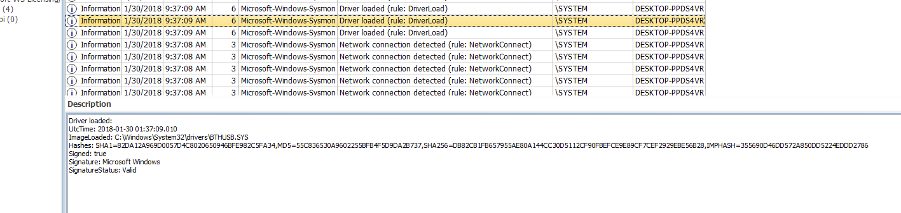

# Driver Loading

## Background
This particular sample isn't from malicious payload but  loading of bluetooth drivers.

## Observations

I used [Event Log Explorer](https://eventlogxp.com) shareware to show some of the fields for this event (ID 6).

You can see UTC time, Image full-path, hashes & **most importantly whether it has valid signature & signer info**.

## Questions

* How often do we see unsigned or invalid signatured drivers loading in a given environment?

* Is the path from user writable folders?
