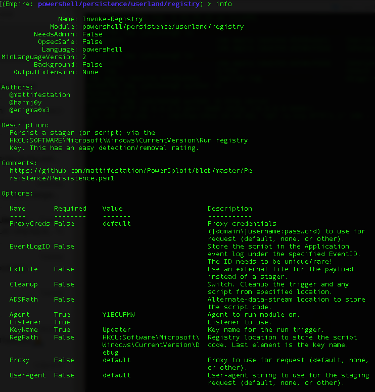
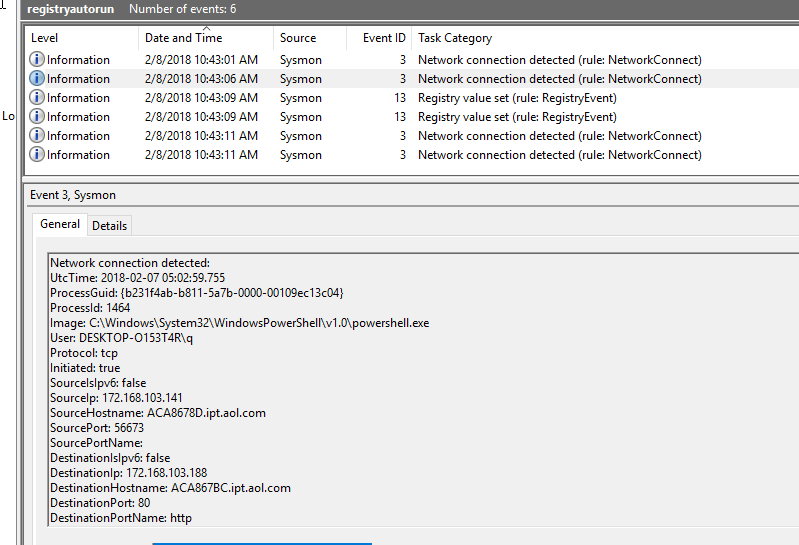
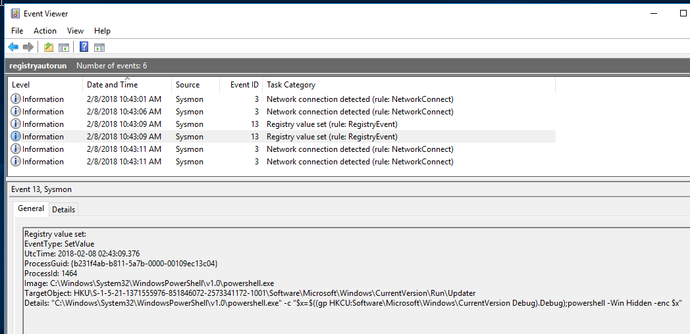

# Registry Autorun

## Background

Run and RunOnce registry keys cause programs to run each time that a user logs on. **The data value for a key is a command line no longer than 260 characters**. Register programs to run by adding entries of the form *description*-*string*=*commandline*. You can write multiple entries under a key. If more than one program is registered under any particular key, the order in which those programs run is indeterminate.

The [Windows registry](https://msdn.microsoft.com/en-us/library/windows/desktop/aa376977(v=vs.85).aspx) includes the following four keys:

- **HKEY_LOCAL_MACHINE\Software\Microsoft\Windows\CurrentVersion\Run**
- **HKEY_CURRENT_USER\Software\Microsoft\Windows\CurrentVersion\Run**
- **HKEY_LOCAL_MACHINE\Software\Microsoft\Windows\CurrentVersion\RunOnce**
- **HKEY_CURRENT_USER\Software\Microsoft\Windows\CurrentVersion\RunOnce**

More info: https://attack.mitre.org/wiki/Technique/T1060

## Empire

[Empire](https://github.com/EmpireProject/Empire) is a post-exploitation framework. By post-exploitation, it means after the initial payload execution & gaining Command & Control (or C2) session over the target machine.

From the module info *Description* field, we can see that it uses Run registry key. For this sample, I will use only the default registry-paths instead of Alternate-Data-Stream ([which I leave it in another sample](https://github.com/jymcheong/SysmonResources/tree/master/6.%20Sample%20Data/stage%202%20(Get%20In)/3.%20install%20payloads/(Type%202)%20Abuse%20userland%20schedule-task)).

## Observations

* The first two lines are related to powershell network activities. The usual stuff like source, destination & so on can be seen.

* We can see the same Powershell process setting value to the TargetObject (registry path), notice it starts with HKU not HKCU. 
* The *Details* field contains the Empire stager-script encoded in Base64 format. 

* Next action writes to Run registry path. Under *Details* field, we can see the command. So one might ask why 2 separate writes, why not just dump everything in one place?

  Earlier in the *Background* section, it says *"The data value for a key is a command line no longer than 260 characters"*, so this is why the payload is written elsewhere.

## Questions

* Is it common for processes to have network activities before & after registry writes?
* Is it possible to have registry paths that are [excluded by certain Sysmon configurations](https://github.com/jymcheong/SysmonResources/tree/master/6.%20Sample%20Data/stage%202%20(Get%20In)/3.%20install%20payloads/(Type%202)%20Abuse%20userland%20schedule-task#why-is-there-no-registry-modification-event-)? 