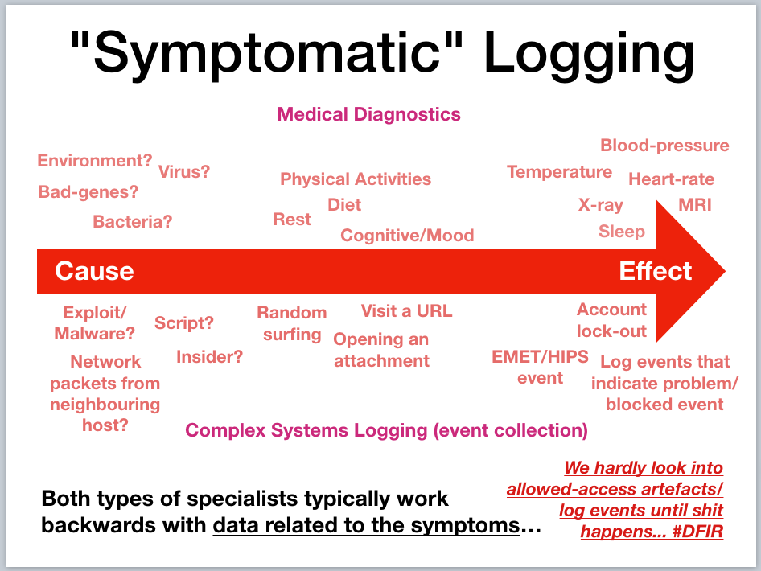
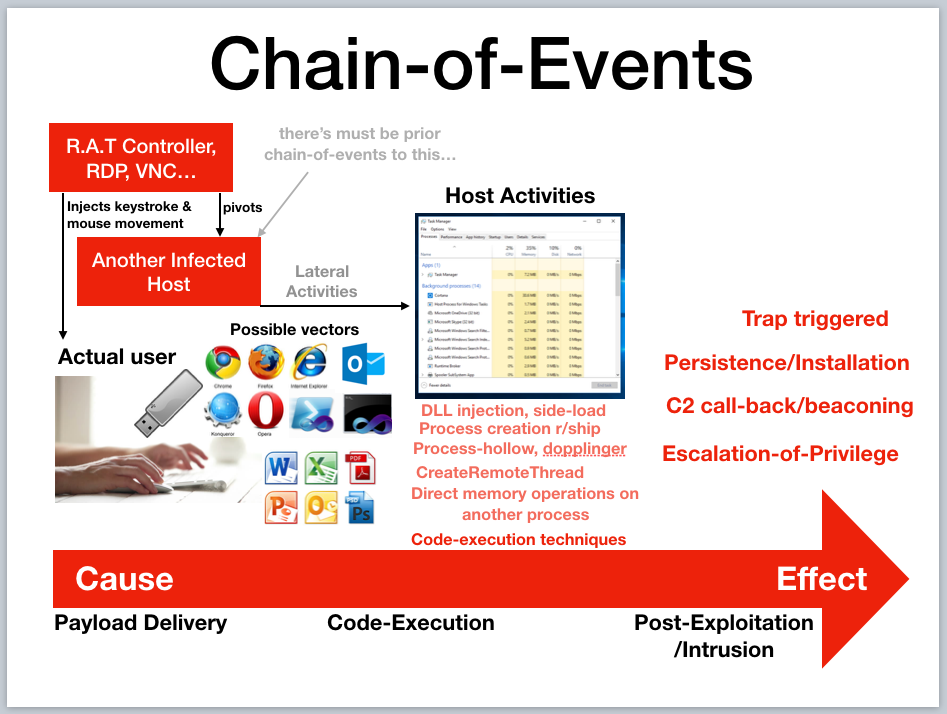

# Threat Analytics
Threat hunting is good but requires prior knowledge of offensive techniques & the [corresponding observables](http://stixproject.github.io/documentation/concepts/composition/) so as to know what to 'hunt'. How to deal with what you don't know? Since we won't know what we don't know, dealing with the unknowns may require some form of data analytics (another school of thought is the use of deception).

* [Cyber Analytics Repository](https://car.mitre.org/wiki/Main_Page) The Cyber Analytics Repository (CAR) is a knowledge base of analytics developed by MITRE based on the Adversary Tactics, Techniques, and Common Knowledge (ATT&CK™) adversary model.

* [Early Threat Warning Analytics](https://coggle.it/diagram/Wi9InZlx9wABS7-3/t/early-threat-warning-analytics/ca532fbf049b71fa2bb88d993e4c2641f87a9edec458c39bf14baca9bc67e682) A mind-map that I'd created to journal the various areas to detect.

* [Red Team Techniques for Evading, Bypassing, and Disabling MS
  Advanced Threat Protection and Advanced Threat Analytics](https://media.defcon.org/DEF%20CON%2025/DEF%20CON%2025%20presentations/DEFCON-25-Chris-Thompson-MS-Just-Gave-The-Blue-Teams-Tactical-Nukes.pdf) Not directly related to Sysmon but more to Microsoft threat analytics.

## Good vs Bad vs "I don't know"  
A viable approach is to learn what are known good/benign within a given environment so as to sieve out the known-bad & things that we have never seen before. After which, investigate those unknowns & turn them into known (either good or bad). Easier said than done for two main reasons:

1. How do we know if we are not learning the evasive bad stuff that's already running in the environment? I devised something to test EDR & threat analytics, basically an [Outlook backdoor using Microsoft Visual Studio Tool for Office](https://www.youtube.com/watch?v=e-rPstKk8rw).

2. Do we even have the "right" data to feed into the machine for learning? 

For the first question, analytics product vendors would have to "teach" their analytic engines with a representative environment (eg. a Cyber Range) that simulates typical user-applications & emulates offensive sequences. It then further begs the question of how close this representative environment is to the actual production ones. So it is common that such products to use "learning" period to close the gap between the products' baselines & actual production environment.

I will delve more on the second question since putting in garbage will to garbage-in-garbage-out & also the typical flaws of sending events from security controls into a programmable IDS known as SIEM. The whole idea of threat hunting is a more dynamic & agile querying (think of it as fast [OODA](https://en.wikipedia.org/wiki/OODA_loop)) compared to the rather static rules/contents within a SIEM, which honestly is hard/painful to program & let alone scale cost-effectively.

## "Symptomatic" Logging

I termed it as "symptomatic" because it is very much like medical diagnostics, you go to the doctor, talked about the symptoms (eg. sneezing, coughing), the doc measures temperature, blood-pressure & so on to make an assessment. Some of the wearables tech like activity & sleep trackers are providing the "in-between" data, which can help to explain the symptoms eg. fatigue/tiredness.

For complex system event logging, there's also the tendency (especially for earlier generations of SIEMs) to record events that are related to the sypmtoms. These type of events are typically emitted from security controls like Endpoint Protection (aka Anti-Virus), Windows Audit events like account logout, network IDS, firewalls & so on. 

If we look at it as a Cause-to-Effect "spectrum", such events are closer to the Effect side. There's alot of in-betweens going on that are not captured thus making it difficult to work backwards to find out the root-cause even if the security controls were to be effective in alerting. Sysmon & netflows are those "in-between" data points that can give more insights compared to just recording a binary good or bad event like firewall or IPS.

Of course, there are more mature/advance organisation that goes to the extend of recording those "in-betweens" events from endpoint & network. This brings us to the next topic; linking the data-points together.

## Chain-of-Events

For the sake of limiting the discussion to Sysmon, I will just focus on client zones that are made up of largely Windows based machines. Of course there are server-zones & non-windows client-endpoints but regardless of Operating Systems, some forms of payloads have to be delivered. 

Client-zones form a large attack surface. By attack surface, I mean the sum of attack vectors. By attack vector, I refer to the means (how) to access/reach the target, in this case the delivery of payloads that run arbitrary codes on the target system. The earlier diagram illustrates the flow from user-actions, to host-processing (code execution regardless good or bad), to let's say some alerts from either endpoint controls &/or network sensors.

# Instead of "working backwards"

After evaluating several EDRs & looking at some of these threat analytics capabilities, I am still not very satisfied with the way the timeline is being presented. It is not easy to conclude if a certain alert was a direct consequence of user's action & it oftens require time-consuming effort to dig forensics artefacts out. By the time we start digging, some of these 'evidence' may have already been erased or even falsely implanted to thwart investigations.

Now for some shameless product marketing for my company, we have a specialised PC known as the [Black-Computer](http://www.digisafe.com/products/trusted-workspace/black-computer/) that offers compartmentalised environments for risky activities like Internet surfing & browsing external content (received from external networks) & another VM for Intranet use-cases. It differs from other products like Bromium, Menlo-Security, even QubeOS because we have a dedicated security chip that is monitoring all hardware bus activities, which includes USB storage, IO devices like keyboard & mouse. 

I will not go into the other features & benefits of Black-Computer but will focus on the user-action tracking using both at OS (which I designed & implemented) & hardware layers. In doing so, we can be quite certain that the alerts are related to user actions, or it could be a result of lateral movement by let's say network packets, something like EternalBlue exploit or even the abuse legit mechanisms like WMI & Powershell remoting. With this linkage in place, it shortens the analysis & time-reconstruction regardless with eye-balls or machine analytics, to discern if it was an insider or remotely controlled.

# Tamper-Detection

Using the "Assumed Breach" mentality, I would assume the adversary would be able to disable Windows Event, the user-tracking OS module & even the hardware instrumentation. By having the redundancy, we can detect the anomalies whenever one signal goes missing. The detection of the last case would be having no HID signals but still seeing network traffic from the endpoint in question (eg. netflow).

To be continued.
