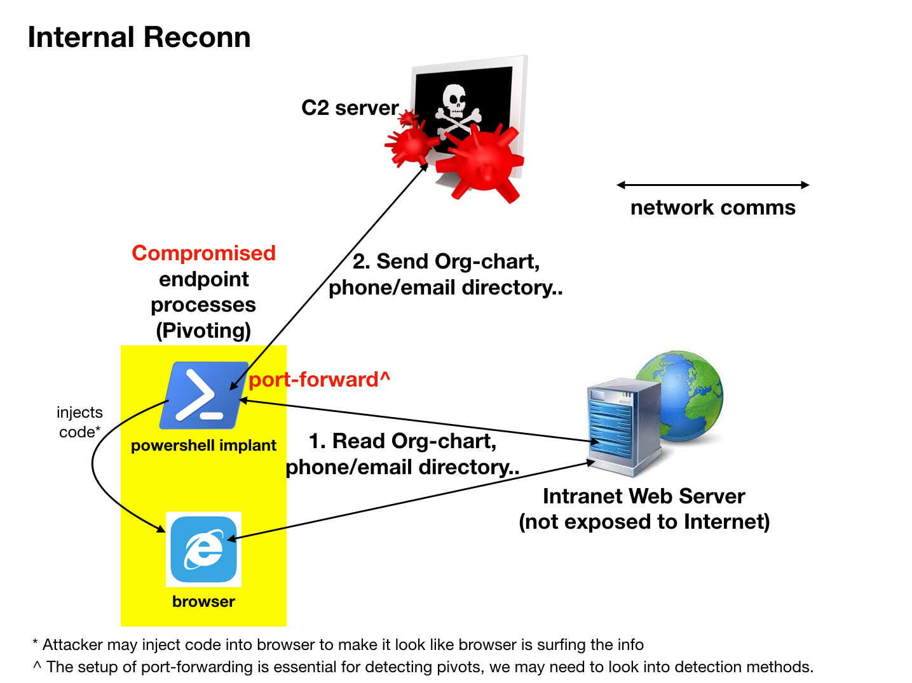
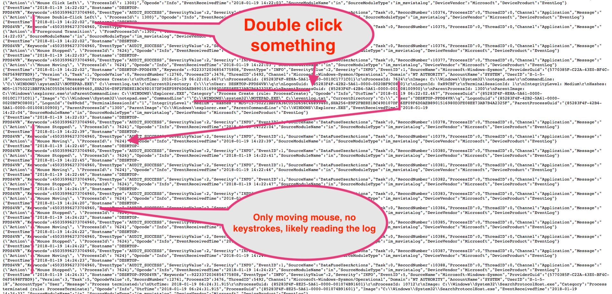
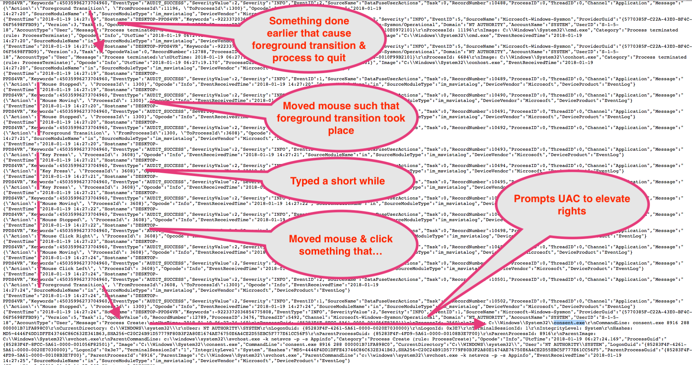

# Threat Analytics
Threat hunting is good but requires prior knowledge of offensive techniques & the [corresponding observables](http://stixproject.github.io/documentation/concepts/composition/) so as to know what to 'hunt'. How to deal with the unknowns? We won't know what we don't know & may require some form of data analytics. Another approach is the use of deception, which is another topic altogether.

* [Cyber Analytics Repository](https://car.mitre.org/wiki/Main_Page) (CAR) is a knowledge base of analytics developed by MITRE based on the Adversary Tactics, Techniques, and Common Knowledge (ATT&CK™) adversary model.

* [Early Threat Warning Analytics](https://coggle.it/diagram/Wi9InZlx9wABS7-3/t/early-threat-warning-analytics/ca532fbf049b71fa2bb88d993e4c2641f87a9edec458c39bf14baca9bc67e682) mind-map was created to journal the various areas to detect.

* [Red Team Techniques for Evading, Bypassing, and Disabling MS
  Advanced Threat Protection and Advanced Threat Analytics](https://media.defcon.org/DEF%20CON%2025/DEF%20CON%2025%20presentations/DEFCON-25-Chris-Thompson-MS-Just-Gave-The-Blue-Teams-Tactical-Nukes.pdf) Not directly related to Sysmon but more to Microsoft threat analytics. 

## Good vs Bad vs "I don't know"  
A viable approach is to learn what are known good/benign within a given environment so as to sieve out the known-bad & things that we have never seen before. After which, investigate the unknowns & turn them into known (either good or bad). Easier said than done for two main reasons:

1. How do we know if we are not learning the evasive bad stuff that's already running in the environment? 

2. Do we even have the "right" data to feed into the machine for learning? 

For the first question, analytics product vendors would have to "teach" their analytic engines with a representative environment (eg. a Cyber Range) that simulates typical user-applications & emulates offensive sequences. It then further begs the question of how close this representative environment is to the actual production site. So it is common to have "learning" period to close the gap between the products' baselines & actual production environment.

I devised something to test EDR & threat analytics, basically an [Outlook backdoor using Microsoft Visual Studio Tool for Office](https://www.youtube.com/watch?v=e-rPstKk8rw). A even simpler backdoor is to just create a BCC forwarding rule as a pre-existing problem to see if the EDR/analytics under test can detect such cases. 

I will dwell more on the second question since garbage-in-garbage-out & also gaps of sending events only from security controls into a programmable IDS known as SIEM. The whole idea of threat hunting is a more dynamic & agile querying (think of it as fast [OODA](https://en.wikipedia.org/wiki/OODA_loop)) compared to the rather static rules/contents within a SIEM, which honestly is hard & painful to program & let alone scale cost-effectively.

## "Symptomatic" Logging

I call it as "symptomatic" because it is very much like medical diagnostics. You go to the doctor, talked about the symptoms (eg. sneezing, coughing), the doc measures temperature, blood-pressure & so on to make an assessment. Some of the wearables-tech like activity & sleep trackers are providing some "in-between" (the timeline of Cause-to-Effect) data, which can help to explain certain symptoms eg. fatigue/tiredness.

For complex system event logging, there's also the tendency (especially for earlier generations of SIEMs) to record events that are related to symptoms. These type of events are typically emitted from security controls like Endpoint Protection (aka Anti-Virus), Windows Audit events like account logout, network IDS, firewalls & so on. 

If we look at it as a Cause-to-Effect time-line, such events are closer to the Effect side. There's alot of in-betweens going on that are not captured thus making it difficult to work backwards to find out the root-cause even if the security controls were to be effective in alerting. Sysmon & Netflows are those "in-between" data points that can give more insights compared to just recording a binary allowed or blocked events from firewalls or IPSes.

Of course, there are more mature/advance organisation that goes to the extend of recording those "in-betweens" events from endpoint & network. This brings us to the next topic; linking the data-points together or what I call data-fusion in short.

## Chain-of-Events

For the sake of limiting the discussion to Sysmon, I will just focus on client zones that are made up of largely Windows based machines. Of course there are server-zones & non-windows client-endpoints but regardless of Operating Systems, some forms of payloads have to be delivered. The same can be applied to mobile platforms, instead of mouse-events, we have screen-taps, keyboards still exist in mobile devices.

Client-zones are large attack surfaces. By attack surface, I mean the sum of attack vectors. By attack vector, I refer to the means (how) to access/reach the target, in this case the delivery of payloads that run arbitrary codes on the target system. The earlier diagram illustrates the flow from user-actions, to host-processing (code execution regardless good or bad), to let's say some alerts from either endpoint controls &/or network sensors.

# Instead of "working backwards..."

After evaluating several EDRs & looking at some of these threat analytics capabilities, I am still not satisfied with the timelines generated by some of these products. It was not straight forward to conclude if a certain alert was a direct consequence of user's action & it oftens require time-consuming effort to dig further. By the time we start digging, some of these 'evidence' may have already been erased or even falsely implanted to thwart investigations.

Now for some shameless product marketing for my company, we have a specialised PC known as the [Black-Computer](http://www.digisafe.com/products/trusted-workspace/black-computer/) that offers compartmentalised environments for risky activities like Internet surfing & browsing external content (received from external networks) & another VM for Intranet use-cases. It differs from other products like Bromium, Menlo-Security, even QubeOS because we have a dedicated security chip that is monitoring all hardware bus activities, which includes USB storage (plus hardware encryption at bus level doing away with expensive USB drives), IO devices like keyboard & mouse. 

I will not go into the other features & benefits of Black-Computer but will focus on the user-action tracking using both at OS (which I designed & implemented) & hardware layers. In doing so, we can be quite certain that the alerts are related to user actions, or it could be a result of lateral movement by let's say network packets, something like EternalBlue exploit or even the abuse of legit mechanisms like WMI, DCOM & Powershell remoting. With this data-fusion in place, it shortens time-reconstruction regardless for eye-balls or machine analytics, to discern if it was an insider or remotely controlled.

# Why network monitoring is not enough?

Consider this internal reconnaisance (post-intrusion) scenario, it is difficult to differentiate between legit access & externally controlled reconn just by looking at network data. Even without network data like NetFlow, Sysmon network events would provide the info relating the process & network details making it standout if it is uncommon for Powershell to access web in a given environment.

To view the Intranet pages on the attacker's terminal, s/he would have to setup port-forwarding on the compromised endpoint, which makes it another indicator to watch for. A careful threat actor may also inject code into a browser process which could be detected with Sysmon events like Event ID 8: CreateRemoteThread & Event ID 10: ProcessAccess. The benefit of linking the process ID to NetFlow is to get volumetric data for further machine analysis.  

# Tamper-Detection & Response

"Assumed Breach" in this case would mean I assume the adversary could disable Windows Event, user-tracking & even the hardware instrumentation. By having redundancy in instrumentation, we can detect anomalies whenever one signal goes missing. The last case would be an abnormal if we have network traffic from the endpoint in question (eg. netflow) but without OS log events (there's Sysmon Event Type 3 at the OS layer).

Another class of tampering apart from silencing the log-source is to inject fake logs into the log-collection sub-system. Simple Syslog listeners without any network access control are susceptible to log spoofing & even Denial-of-Service. A fleet of Black-PCs are connected to a centralised monitoring system via out-of-band network channel. Even with the worst case scenario of log collection being bombarded by one or few machines, we can use the independent Black-PC management to disarm the offending machine(s) remotely.

# Sample Insider Scenario

By tracking the user-actions & linking to the foreground application ProcessID without recording the actual keystrokes/mouse-coordinates, we can better understand the entire sequence of events for both humans & machine-learning without compromising privacy & confidentality. In the case above, it seems the user launched Notepad to view log file, or was it really just reading...

If the consequent program that ran after UAC consent (elevating to admin rights) is Notepad again with that same log file & there are key-press events with Notepad as the foreground app, then there are reasons to believe the user has changed something in the log file. This is also the juncture to justify to look into the Black-PC central monitoring backend to pull out the screen-recording for this suspicious activity.

# Summing it up

Before we debate about which detection methods, algorithms, products are better & so on, it is fair to say that what data we capture matters. To sum it up:

1. Capturing "symptomatic" alerts is not enough, we need the "in-between" (the Cause-to-Effect timeline) data to make sense of the situation; whether it is an externally controlled or insider act.

2. Instead of working backwards, we want to construct chains-of-events forward starting from user-actions related to foreground process, link any processes that communicate regardless north-south or east-west traffic with Netflow data.

3. Have strategies & implementations to deal with log tampering in an event of privilege escalation on the host.

