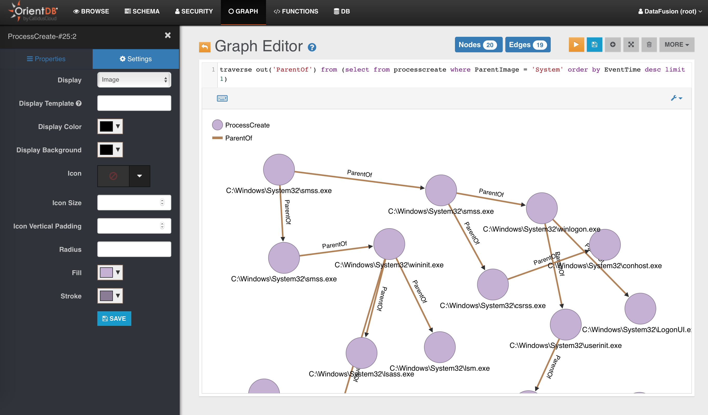
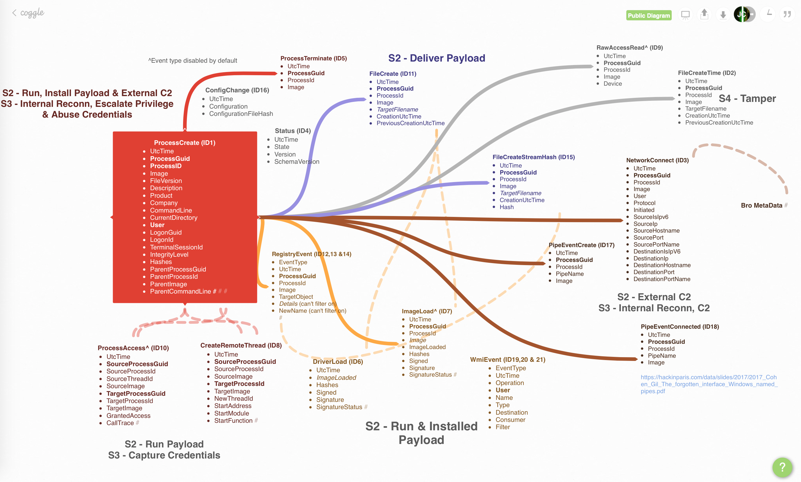

# Sysmon Visualization (SysmonViz)

## Why?
I needed a reason to tinker with NodeJS & a graph database & this is a good one. Please forgive me if some of the Javascript codes are horrible! It is part of my other projects:

* [Automated Payload Test Controller](https://github.com/jymcheong/aptc)
* [Automated Tactics Techniques & Procedures](https://github.com/jymcheong/AutoTTP)
* [One-way Transport of System Event Logs via SFTP](https://github.com/jymcheong/OneWaySFTP)

**SysmonViz is not meant for production**. I have yet to test it on a larger network with high event rate. Sysmon itself also has certain limitations. It is useful to understand what's going on within a Windows host at a "mid-level" granularity as oppose to deep instrumentation down to the APIs or machine instructions level.

## How does it look like?



Short demo: https://www.youtube.com/watch?v=Ct-hDKOga_E

Much of the database schema was derived from [SwiftOnSecurity's sysmon configuration](https://github.com/SwiftOnSecurity/sysmon-config). 

 

[Larger view of the visual](https://coggle.it/diagram/WvvSk9Ze3m6uVsDJ/t/processcreate-id1-utctime-parentcommandline). You can think of "S" as severity or stages of an [Attack Life Cycle](https://jym.sg/#Attack%20Life%20Cycle:%5B%5BAttack%20Life%20Cycle%5D%5D).

## Getting Started

SysmonViz uses a multi-model database ([OrientDB Community Edition](https://orientdb.com/community/)) as datastore & visualization backend. Much of the functions are implemented within the database server-side functions. **Install the backend first** before proceeding to the target Windows (virtual) machine.  Much of the installations are automated by scripting except the part to change your OrientDB hostname/IP for the *[filemonitor.js](https://github.com/jymcheong/SysmonResources/blob/9c70071e99cd7d304a4623b42a131156ceb6e235/5.%20Threat%20Analytics/orientDB/filemonitor.js#L6)* script. 

### Windows based OrientDB 

**Please ensure Java 8+ runtime is installed**. Use an **admin CMD console** & paste the following ([review script source](https://github.com/jymcheong/SysmonResources/blob/master/5.%20Threat%20Analytics/orientDB/installationScripts/installorientDB.ps1)):

```
powershell -nop -c "iex(New-Object Net.WebClient).DownloadString('https://raw.githubusercontent.com/jymcheong/SysmonResources/master/5.%20Threat%20Analytics/orientDB/installationScripts/installorientDB.ps1')"
```

### *nix based OrientDB

Please ensure **wget** & **Java** **8+ runtime** are installed. Download the [installation script](https://raw.githubusercontent.com/jymcheong/SysmonResources/master/5.%20Threat%20Analytics/orientDB/installationScripts/installorientDB.sh). Chmod +x the script file & run it.

### Windows Client (tested on 7-10 32/64bit) 

Use an **admin CMD console** & paste the following ([review script source](https://github.com/jymcheong/SysmonResources/blob/master/5.%20Threat%20Analytics/orientDB/installationScripts/installsysmonviz.ps1)):

```
powershell -nop -c "iex(New-Object Net.WebClient).DownloadString('https://raw.githubusercontent.com/jymcheong/SysmonResources/master/5.%20Threat%20Analytics/orientDB/installationScripts/installsysmonviz.ps1')"
```

**Please ensure that the Windows (to-be-monitored) host can communicate with your OrientDB server. *Eg. Able to visit OrientDB web admin page with the host's browser.***

A breakdown of what the script is doing:

1. Creates a Desktop folder *sysmonviz*
2. Downloads Sysmon, Nxlog-CE, 2 custom configuration files & filemonitor.js into the earlier folder
3. Does all the installations
4. Pops up the log folder, you should see logs appearing in rotated files; a success indicator
5. Installs a Windows Task Scheduler to start filemonitor.js **upon startup**.
6. Launches another Powershell script to install portable nodeJS for filemonitor.js.
7. Pops up notepad for you to edit filemonitor.js. **Replace ODBHOST with your OrientDB hostname or IP address** 

**After you reboot your Windows client, the filemonitor.js will run & insert Sysmon events into the OrientDB.**

Do take a look at some of the [useful queries in the wiki section](https://github.com/jymcheong/SysmonResources/wiki/Useful-queries).