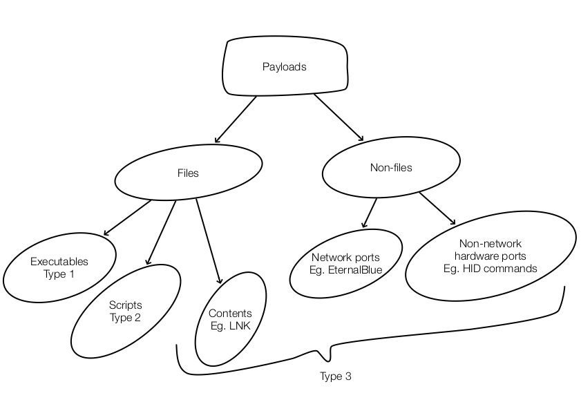

# How do "bad" things get in?

## Impossible to enumerate all techniques

*Payload Delivery* is related to the "Execution" tactics (https://attack.mitre.org/wiki/Execution). There are a myraid of techniques for different systems so it is unlikely to enumerate ALL techniques. One school of thought for dealing with *Payload Delivery* is to enumerate "bad" things & try to block them at network layer (blacklisting with signatures), be it in the form of files or packets. There are other defense methods beyond blacklisting & are more deterministic & reliable, but beyond the scope of this discussion.

## Further sub-divide payloads...

We can further "sub-divide" code-execution by asking something more fundamental: **"How to run codes on a computer?"**. Think of payload types as the "link" between delivery & execution: Compiled executables binaries (type 1), Scripts (type 2) & Others (type 3, typically with shell-codes hidden within user-contents, or network packets/physical-port commands).  **Type 1 & 2 use features from the system whereas Type 3 tend to exploit vulnerabilities.**

Relating back to an earlier point about "other defense methods", a reliable way beyond signature-based blacklisting is the neutralisation of *Type 3 - User Content payloads* using [Content Disarm & Reconstruction](https://en.wikipedia.org/wiki/Content_Disarm_%26_Reconstruction). Other novel approach include detecting machine-codes within User Contents (not executables or scripts) & deny such files altogether without having to decide whether it is good or bad codes.

## Payload Delivery

The sample logs here attempt to illustrate some common delivery tactics.

| Means to deliver                 | Type 1                                                       | Type 2                                        | Type 3                                                       |
| -------------------------------- | ------------------------------------------------------------ | --------------------------------------------- | ------------------------------------------------------------ |
| Email                            | Mostly should be blocked                                     | Possible to get through                       | Usually get through for 0-day, there's no signature/patch yet |
| Browser                          | Possible to download depending on environment                | Possible to download depending on environment | Usually allowed to download                                  |
| Network or Physical device/ports | Embedded within packets. Direct execution as with HID attack. | Direct execution as with HID attack.          | In the form of packets or datagrams for network delivery, or files from removable storage device. |

In a end-user environment (client-zone), the most common element that one has to deal with is **files**. A malicious file can come attached in an email or just an URL to a file/content that leads payload execution. There also cases where there is no explicit file, but specially crafted contents will cause the reader (eg. browser, PDF viewer) to run arbitrary codes.

In a server environment, listening ports will tend to be under attack, usually in the form of network packets. For web applications that accept user inputs, attacks are delivered either by web-UI form-elements or by HTTP(S) based RESTFUL APIs. **The samples here will not include server-side attacks.**