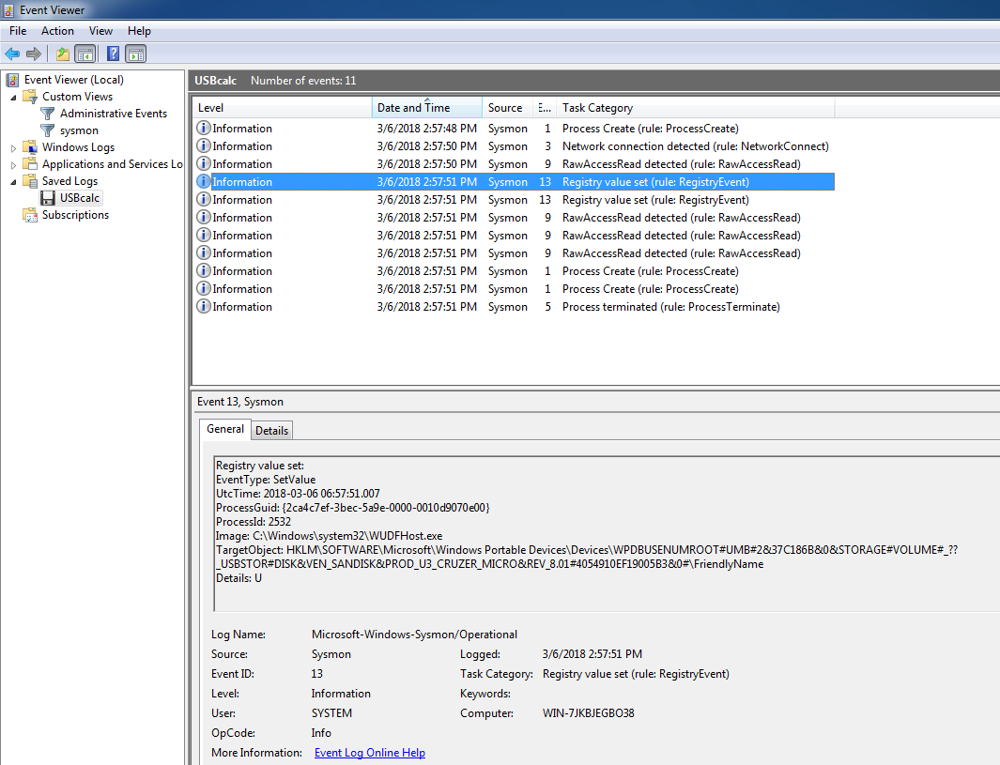
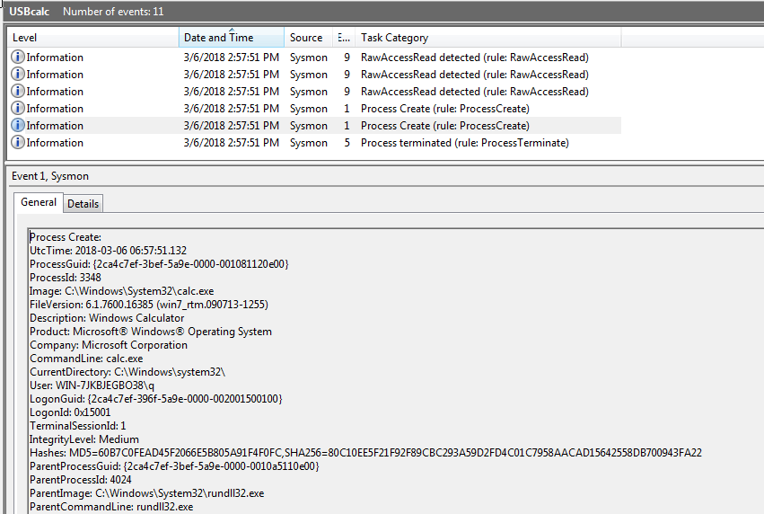

# Removable Storage Media

## Payload

Type 1 (executables) & Type 2 (scripts/configurations) are rather straight-forward with Sysmon Event ID, especially for controlled user environments that enforce Application-Control/Whitelisting. Outliers can be detected at 2 levels, host & population. I will not digress since that has to do with analytics. For the earlier reasons, I selected a LNK exploit ([CVE-2017-8464](https://portal.msrc.microsoft.com/en-US/security-guidance/advisory/CVE-2017-8464)) from Metasploit. If you are repeating this experiment, you will most probably need to temporary switch off your Anti-Virus engine.

## Observations

* From TargetObject field, we can see the USB storage device in question
* There are 3 RawAccess Reads (2 from SVChost + last one Explorer process)

* Not surprising to see Rundll32, after all that Metasploit module will produce a payload that is a DLL (CPL). Note the parent process is Explorer.exe
* After which, immediately we get:

* I use launching a calculator as an illustration since the topic here is about delivery, not so much on the execution although the two are very related.
* Notice all happened within 2:57:2. We can infer there's no user intervention.

## Questions

* What happens when a payload requires user-interaction/intervention? How do we observe?

