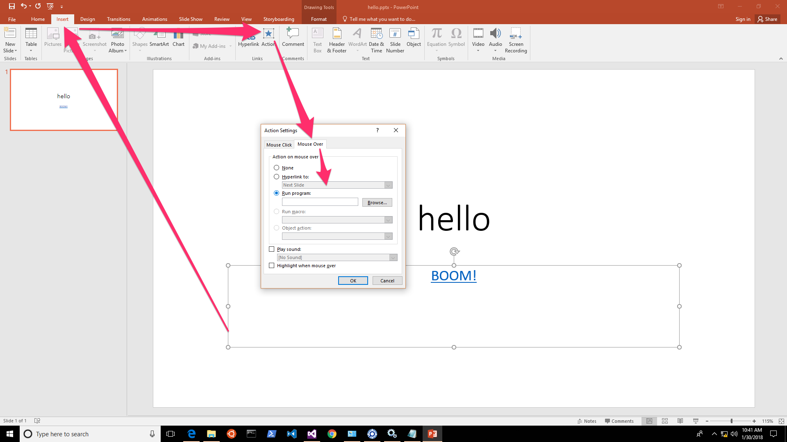

# Abuse PowerPoint Actions

## Background
This is a type 2, it's a feature not a bug ;) Nice for App-Control/Whitelisting evasion + social engineering/deception (eg. something visually compelling to mouse-over).

## Payload
I will also use this sample to illustrate the idea of attack-chaining by linking it to [another sample which is Type 1 - Rundll32 Allthethings.dll](https://github.com/jymcheong/SysmonResources/tree/master/6.%20Sample%20Data/stage%202%20(Get%20In)/2.%20run%20payloads/(Type%201)%20Allthethings.dll%20with%20rundll32). I also include a normal Powerpoint file open log sample for comparison & constrast.

## Observations

### open pptx file eventlog.txt (normal)
1. Unlike the [Excel sample](https://github.com/jymcheong/SysmonResources/tree/master/6.%20Sample%20Data/stage%202%20(Get%20In)/2.%20run%20payloads/(Type%202)%20Abuse%20MS%20Excel%20DDE), we can see which Powerpoint file was opened from CmdLine field [(log line 1)](https://github.com/jymcheong/SysmonResources/blob/9ee273f2f237f727bf1bf54d9459d539bef21c08/6.%20Sample%20Data/stage%202%20(Get%20In)/2.%20run%20payloads/(Type%202)%20Abuse%20MS%20PPT%20Mouse-over%20Action/open%20pptx%20file%20eventlog.txt#L1).

2. After running this a few times, you will notice [SPPSVC.exe](https://www.bleepingcomputer.com/startups/sppsvc.exe-25807.html) will always follow after launch of Powerpoint (& Office apps). It has to do with software licensing.

### mouse-over rundll32.txt (attack chaining)
In this case, the Kali C2 is offline, otherwise, logs related to rundll32 are very much similar to [Type 1 - Rundll32 Allthethings.dll](https://github.com/jymcheong/SysmonResources/tree/master/6.%20Sample%20Data/stage%202%20(Get%20In)/2.%20run%20payloads/(Type%201)%20Allthethings.dll%20with%20rundll32)

1. Again we can see SPPSVC.exe again [(line 2)](https://github.com/jymcheong/SysmonResources/blob/0f7dcae09c7a20d62f7fba320351e317d75084ed/6.%20Sample%20Data/stage%202%20(Get%20In)/2.%20run%20payloads/(Type%202)%20Abuse%20MS%20PPT%20Mouse-over%20Action/mouse-over%20rundll32%20eventlog.txt#L2).

2. Use ProcessGUID {85283F4F-E593-5A6F-0000-001088D15E04}, you will match [line 5](https://github.com/jymcheong/SysmonResources/blob/0f7dcae09c7a20d62f7fba320351e317d75084ed/6.%20Sample%20Data/stage%202%20(Get%20In)/2.%20run%20payloads/(Type%202)%20Abuse%20MS%20PPT%20Mouse-over%20Action/mouse-over%20rundll32%20eventlog.txt#L5) & [12](https://github.com/jymcheong/SysmonResources/blob/0f7dcae09c7a20d62f7fba320351e317d75084ed/6.%20Sample%20Data/stage%202%20(Get%20In)/2.%20run%20payloads/(Type%202)%20Abuse%20MS%20PPT%20Mouse-over%20Action/mouse-over%20rundll32%20eventlog.txt#L12).

3. Line 5 tells us Powerpoint writes to a temp file.
4. Line 12 tells us Powerpoint is the parent of Rundll32 with CmdLine revealing the DLL being loaded.
5. [Line 13](https://github.com/jymcheong/SysmonResources/blob/0f7dcae09c7a20d62f7fba320351e317d75084ed/6.%20Sample%20Data/stage%202%20(Get%20In)/2.%20run%20payloads/(Type%202)%20Abuse%20MS%20PPT%20Mouse-over%20Action/mouse-over%20rundll32%20eventlog.txt#L13) is also Rundll32 but from SysWow64 but it is the child of earlier Rundll32.
6. Since there's no C2 available, both Rundll32 instances terminated at line 20 & 21.
7. Effectively the Parent -> Child chain: Explorer -> PowerPnt -> Rundll32 -> SysWOW64/Rundll32

## Questions
Similar to that in [Excel sample](https://github.com/jymcheong/SysmonResources/tree/master/6.%20Sample%20Data/stage%202%20(Get%20In)/2.%20run%20payloads/(Type%202)%20Abuse%20MS%20Excel%20DDE) except now...

1. How does the Parent -> Child chain differ with various MS Office apps, or for that matter any legit apps in your environment?

2. How different for documents generated internally vs downloaded ones?

3. How does one tell that the docs are downloaded?

4. Beyond Parent -> Child chain, does it make sense to link to Sysmon Network Connection & other event types?

For question 3, beyond file path inferred from CmdLine, Internet Explorer/Edge will add an [Alternate Data Stream for contents downloaded](https://stackoverflow.com/questions/4496697/what-is-zone-identifier) from the Internet, thus causing that warning prompt. I don't think it can be inferred from any of the Sysmon events but it may good to know.

Like the questions posed for some of the Type 1 samples, asking a broader question that looks at the relationship between fields & indicators that span across the offensive tactical group will give us better understanding between what is normal & unusual. **To put it simply, the effects of attack-chaining can be observed with a series of Parent -> Child sequences, linking with other Sysmon events.**