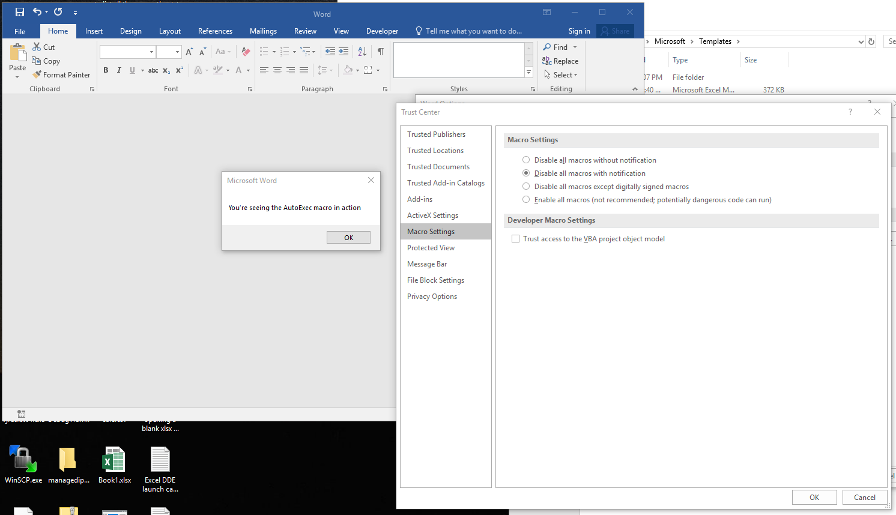
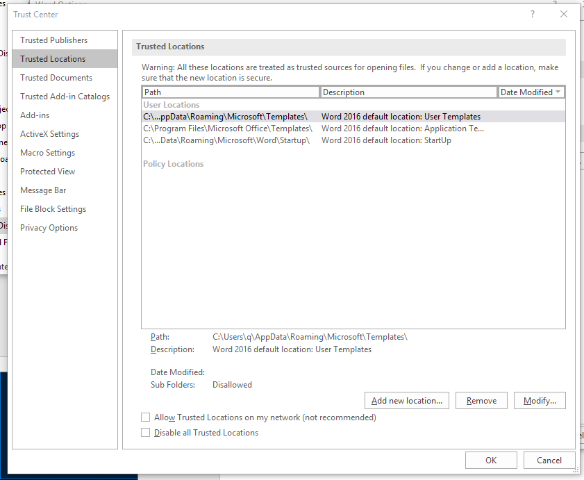
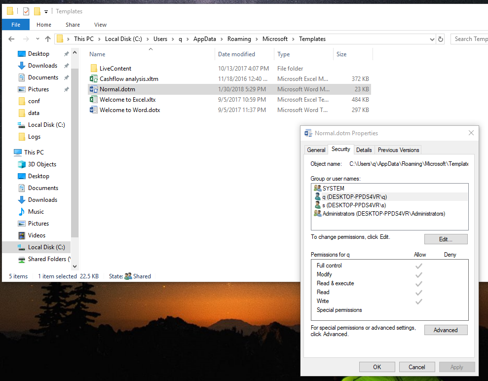

# MS-Office Macro Abuse

## Background
Like the other samples using [DDE](https://github.com/jymcheong/SysmonResources/tree/master/6.%20Sample%20Data/stage%202%20(Get%20In)/2.%20run%20payloads/(Type%202)%20Abuse%20MS%20Excel%20DDE) & [Mouse-Over](https://github.com/jymcheong/SysmonResources/tree/master/6.%20Sample%20Data/stage%202%20(Get%20In)/2.%20run%20payloads/(Type%202)%20Abuse%20MS%20PPT%20Mouse-over%20Action) actions, [Macros is also a legitimate feature](https://www.ncsc.gov.uk/guidance/macro-security-microsoft-office) within the MS-Office suite of applications. In other words, DDE & mouse-over also works in Winword. 

## Payload
For the sake of completeness, I will use Macros in Winword, which is Visual Basic **scripting** & in this case, ability to invoke shell commands. This payload again will use Rundll32 to launch a Meterpreter session. But what is interesting during the exercise of preparing this sample & respective logs is this:

**When you put the Macros into the Normal.dotm, it will still run even if Macros are disabled:**

That's because that template file is in a trusted location defined in:

Note macros are suppose to be disabled.

That folder is user writable. Which leads to another problem of repeated code-execution which is termed as persistence. In my ALC model, I call it ["installation of payload"](https://github.com/jymcheong/SysmonResources/tree/master/6.%20Sample%20Data/stage%202%20(Get%20In)/3.%20install%20payloads) typically for purpose of persistent external control after reboot or after-startup from shutdown. With MS-Office, one can either overwrite template files &/or change user-writable registry keys to trust the entire C: drive. In enterprise environment, we can use GPO to mitigate this by getting MS-Office to use HKLM settings instead.

Lest I disgress further, let's move on to the logs...

## Observations
### open a docx eventlog.txt
For "normal" documents, the logs should look something what I have. 

* From line 1, *we can see the exact file that was opened in the CmdLine field*.

* Line 2, again SPPSVC service runs immediately after Word launched.

### macro to rundll32.txt

* Much like the [Powerpoint sample](https://github.com/jymcheong/SysmonResources/tree/master/6.%20Sample%20Data/stage%202%20(Get%20In)/2.%20run%20payloads/(Type%202)%20Abuse%20MS%20PPT%20Mouse-over%20Action), Winword launched Rundll32

* As with the other samples using Excel, Powerpoint & now Winword, **there is NO DIRECT evidence to tell us the exact mechanism, be it DDE, mouse-over & so on, that caused further program execution from these Office apps.** 

* As such, **it is possible** to have some other exotic feature/mechanism that can cause further program execution. SPPSVC is another good example, after seeing it automatically launch everytime any MS office apps is executed. ***Suppose there's a flaw in SPPSVC, then it may be viable that the initial office document may deliver in such a way that SPPSVC end up spawning a new process & gaining privilege in the process of exploiting since SPPSVC runs under NETWORK SERIVCE account.*** 

The EquatorEditor exploit is one such example, abeit not an escalation of privilege...

## Questions
I don't want to repeat questions in entries for [Excel](https://github.com/jymcheong/SysmonResources/tree/master/6.%20Sample%20Data/stage%202%20(Get%20In)/2.%20run%20payloads/(Type%202)%20Abuse%20MS%20Excel%20DDE#questions) & [Powerpoint](https://github.com/jymcheong/SysmonResources/tree/master/6.%20Sample%20Data/stage%202%20(Get%20In)/2.%20run%20payloads/(Type%202)%20Abuse%20MS%20PPT%20Mouse-over%20Action#questions) here. Different ones that I can think of:

* Is it possible to have User field value that differs from the parent process? 

* Similar to the first, but instead IntegrityLevel differing?

These are priming questions that leads to another topic of Privilege Escalation. It should be clear by now that just a single event type, ProcessCreation, can tell us quite a bit of things.