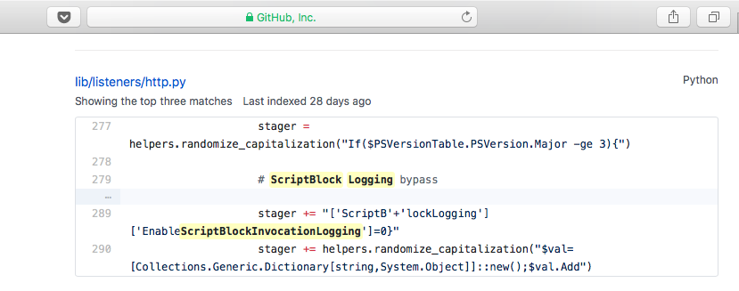

# Outlook VSTO Backdoor

## Background

**V**isual **S**tudio **T**ools for **O**ffice is a developer tools that provide features that help you create Office solutions to suit a variety of business needs. Unfortunately it can also be abused to create a backdoor. VSTO is not the only legit mechanism with MS-Office suite, there are others as eluded within https://labs.mwrinfosecurity.com/blog/add-in-opportunities-for-office-persistence/

More info: https://attack.mitre.org/wiki/Technique/T1137

## Backdoor

This is a Proof-of-Concept backdoor that I had *written to simulate a non-beaconing C2 (ie. secondary C2 channel in case first one was caught)*. Demo: https://www.youtube.com/edit?o=U&video_id=e-rPstKk8rw. In short, when the compromised Outlook client receives a specially crafted email, the Outlook client performs the Powershell commands within the mail-body & deletes the mail very quickly such that it is not discernable to the user.

This backdoor is installed via Empire scripting done with [AutoTTP, a framework](https://www.youtube.com/edit?o=U&video_id=aW_imj75M_A) that I'd developed that allows combinations of different toolkits (eg. Empire + Metasploit) & organised into different attack stages & steps. I will outline the high-level steps taken by [this script](https://github.com/jymcheong/AutoTTP/blob/master/stage2/install_payload/windows/empire_install_outlook_VSTOc2.py) to install this VSTO backdoor:

1. Checks Outlook version, proceed if >= 15.0 (at least Outlook 2013)
2. Checks & proceeds if .NET 4 client is available
3. Get VSTO installer program path
4. Get User's Local App Data path
5. Add registry settings for silent VSTO installation
6. Download VSTO zipped contents into path from step 4
7. Unzip the zip file from previous step
8. Use VSTO installer path from Step 3 to silently install the VSTO package
9. Checks & proceed if backdoor is successfully installed
10. Gets email address & print

Most of the other Empire payload installation samples so far are pretty straight-forward & short, this case is a lot more (100 lines of logs) so it will be pretty verbose for me to describe line by line… I will related the time-range from the log with the earlier installation steps & highlight the significant points.

## Observations

I omitted logs related to the initial establishing of C2 with the Empire listener. The test was conducted on an updated Win 10 enterprise VM with [Powershell logging](https://blogs.technet.microsoft.com/ashleymcglone/2017/03/29/practical-powershell-security-enable-auditing-and-logging-with-dsc/). To zoom into the range within the Event Viewer Sysmon logs, my script prints out the time-stamp right before & after the backdoor installation. I then select the start-row within Event Viewer & bulk select to the end-row that was slightly later than the script-end timestamp.

* Log lines from 3:09:23 to :48 are related to Step 1 to 4. **By right, looking at the Powershell Operational logs will show the script blocks that were being executed but I could NOT find any.** I was quite sure that I enabled the Powershell Script Block logging but yet the Powershell logs related that time-frame was missing. Bear in mind, the backdoor installation had already completed. I decided I would just reboot the VM & redo…. then I noticed after re-ran the Empire stager to get a new C2 session:

   

* That timestamp is after the installation run but notice **there's a SetValue call within the strange looking block**. So I went to Empire Github & did a search:

   

  So it's clear that there's means to bypass but the very initial code that sets the bypass is logged.

* Entire set of 3:09:51 log lines relates to Step 5, you can use Event Viewer to see TargetObject (ie. reg path) Details (contents) fields. Those registry settings part of the VSTO installation trust settings. Why it can be silently installed is because the **system implicitly trust a locally published VSTO package (by design) as oppose to one that was downloaded from the Internet, files downloaded from the Internet has a hidden ZoneIdentifier ADS attached to download files thus allow Windows to prompt warning.** ***I won't go into details as it is not a good idea that more people start using this.***

* You will also notice there's always a registry create (`TargetObject: HKU\S-1-5-21-1371555976-851846072-2573341172-1001\Software\Microsoft\Windows\CurrentVersion\Internet Settings\Connections`) even following every *Network connection detected* for Powershell process.

* From 3:10:01 to 02, Powershell wrote a number of files related to step 6 & 7 of the backdoor installation. You can see exact file path from *TargetFilename* field.

* From 3:10:03 to 08, the silent VSTO installation started (step 8). You will see a Event ID 1 - Process Create showing the exact CommandLine that was used:

  * `"C:\Program Files\Common Files\Microsoft Shared\VSTO\10.0\VSTOInstaller.exe" /s /i C:\Users\q\AppData\Local\Apps\antispam\AntiSpam.vsto`
  * where /s is the silent switch
  * Before the Process Create, you will also see anonymous PIPE created & connected Event ID 17 & 18 respectively.

* From 3:10:08 Process Create onwards until 3:10:10 Process Termination (Event ID 5) of VSTOInstaller.exe, a series of File Create & Registry value-sets which are still related to Step 8 of installation.

* **After** the 3:10:10 Process Terminate of VSTOInstaller, the events are related to the remaining steps of the installation.

## Other Comments

* Through the preparation of all these samples, I had to change the Sysmon filtering from [SwiftOnSecurity's Github repo](https://github.com/SwiftOnSecurity/sysmon-config) because some of the registry & file create events were excluded. 

* Given Empire is open-source, it is **reasonable to believe that Powershell Script Logging bypass will be used to hide the detail codes within the Powershell offensive scripting**. One can also [investigate the source-codes](https://github.com/EmpireProject/Empire/blob/7303a4e089ced4ed1d56ef2265673abff0922442/lib/listeners/http.py#L279) of Empire listener to better understand how the bypass is accomplished. 

  In short, it is manipulating cachedGroupPolicySettings & **there's also [@mattifestation's AMSI bypass](https://twitter.com/mattifestation/status/735261176745988096?lang=en) such that the script won't be blocked by Windows 10 Anti-Malware scanning**. CyberArk has a patch to the bypass: https://www.cyberark.com/threat-research-blog/amsi-bypass-patching-technique/

* **Every "Disadvantages" listed in [MWR's post](https://labs.mwrinfosecurity.com/blog/add-in-opportunities-for-office-persistence/) are the potential indicators that can be observed with Sysmon events (or whatever your EDR/hunting tool is)**, especially those related to file drops & registry changes. The thing I managed to figure out was to silently install the VSTO package. It was tested on another VM that was not used to develop VSTO.

## Questions

* This particular sample can be thought of as a representative of a custom implant, but what happens if we craft detection queries/logic too specific to certain methods? *A good starting point to answer that: https://www.carbonblack.com/2016/06/14/defining-effective-patterns-attack-machine-learning/*
* Even before talking about detection logic, how do we ensure that we have not [excluded events out due to the Sysmon configuration that was used](https://github.com/jymcheong/SysmonResources/tree/master/6.%20Sample%20Data/stage%202%20(Get%20In)/3.%20install%20payloads/(Type%202)%20Abuse%20userland%20schedule-task#questions)? *This was observed with another sample related to [abusing userland scheduled task](https://github.com/jymcheong/SysmonResources/tree/master/6.%20Sample%20Data/stage%202%20(Get%20In)/3.%20install%20payloads/(Type%202)%20Abuse%20userland%20schedule-task).*

