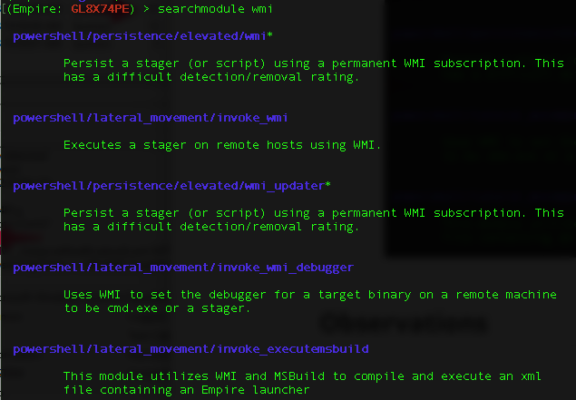
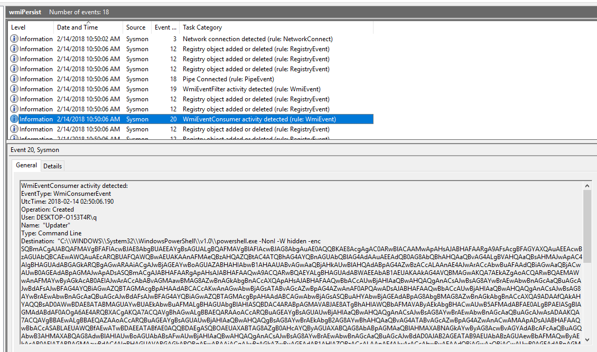
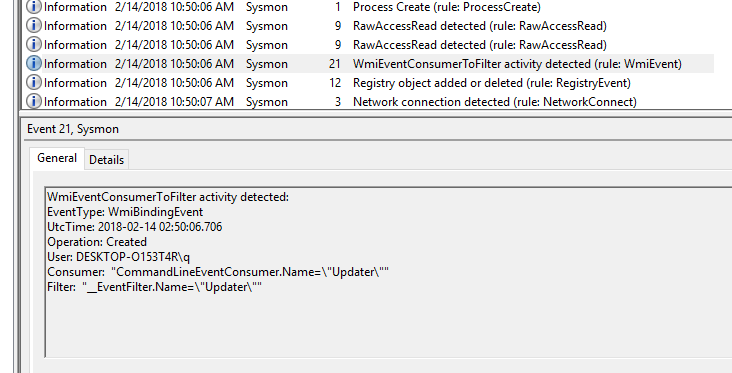
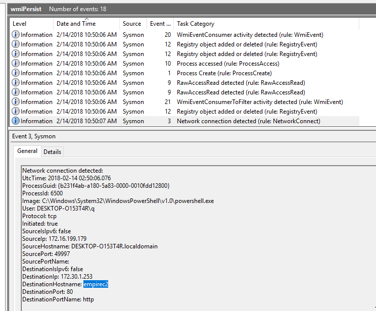

# Abusing WMI for Persistence

## Background

Windows Management Instrumentation (WMI) can be used to install event filters, providers, consumers, and bindings that execute code when a defined event occurs. Adversaries may use the capabilities of WMI to subscribe to an event and execute arbitrary code when that event occurs, providing persistence on a system. Adversaries may attempt to evade detection of this technique by compiling WMI scripts. https://attack.mitre.org/wiki/Technique/T1084. The reference section on the ATT&CK page has several good papers for those who want to dig deeper. 

## Empire

**Take note of the SubName field "Updater", we will need it later during Observations.** This module was used to install persistence. There is no direct file or registry key written but again one will notice some registry events later. 

It also interesting to contrast the relative ease of installing payload/persistence with a privilege Empire session, but yet it may not be so straight forward to detect such persistence if we don't know what to look for. There are other WMI related modules:

The asterisk (*) means it requires admin rights or privilege session to run. 

## Observations

* All 3 WMI events (id 19, 20 & 21) all have *"Updater"* as value in the *Name* field. This value is the same as the Empire module. 

* From the other fields, there is no direct link to the Empire Powershell instance. The only clue we have is the entire sequence happened on the same second 10:50:06. 

* The registry events has nothing to do with the WMI implant but related to powershell networking.

* Even the Process Create event **has no direct link with the offensive Powershell process**:

  

  WMI Provider Host was invoked when implanting this WMI subscription. 

* The general sequence of WMI subscription: [setup Filter & Consumer, follow by linking Consumer](https://learn-powershell.net/2013/08/14/powershell-and-events-permanent-wmi-event-subscriptions/) to Filter. The *WMI consumer Command Line* can be seen below, has a the Empire stager encoded in the Base64 block:

  

* WMI Event ID 21 that binds the Filter to Consumer looks like:

  

* The last two events are related to Powershell network connection back to the Empire listener (C2 server). *I used a stupidly obvious host name: empirec2 for illustration reason*. In the real world, it is trival to use web-servers (eg. Nginx) to front it with [valid but free SSL cert](https://letsencrypt.org) & domain name. 

  

  ​

## Questions

* Are these WMI events (id 19, 20 & 21) commonly seen in a typical windows client zone/environment?
* Apart from time of sequence, is there any other way to reliably to know which process triggered the WMI events? 

