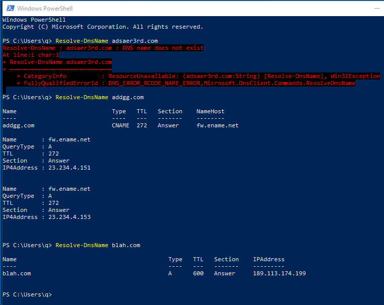

# External C2 over DNS

## Background

https://attack.mitre.org/wiki/Technique/T1043 Why DNS when there's HTTP(S)? When network gateways/sensors may be watching HTTP(S)? Or as a [backup/fall-back channel](https://attack.mitre.org/wiki/Technique/T1008). 

## Offensive Toolkits

Server: https://github.com/iagox86/dnscat2

Client: https://github.com/lukebaggett/dnscat2-powershell

Lenny Zeltser has a good discourse on this tool: https://zeltser.com/c2-dns-tunneling/

## Observations

For this sample log, I compiled dnscat2.exe from source from the Server Github link. *I somehow could not get the Powershell client to work. It use to work when I'd setup an authoritative DNS for a test domain some time ago, it had expired.* Anyway, the Powershell client is not stable & tends to crash. 

* So you can see, there is a *Network connection detected* event for dnscat2.exe. But that's the only one.. the rest are nothing to do with the C2 client.
* If you refer to Zeltser's article, you will notice repeated query-response in his Wireshark trace. 
* It make sense since Sysmon only records initiated connection from a process, it does not continously create events whenever a session has traffic.

Since I couldn't get the Powershell client to work, I did something I thought was equivalent:

* Interesting, when I switch back to Event Viewer with filter on event ID 3, ***there was NOTHING for Powershell***
* This may not be an equivalent, but even if it did record, likely it will be same as dnscat2.exe, only a single event.

