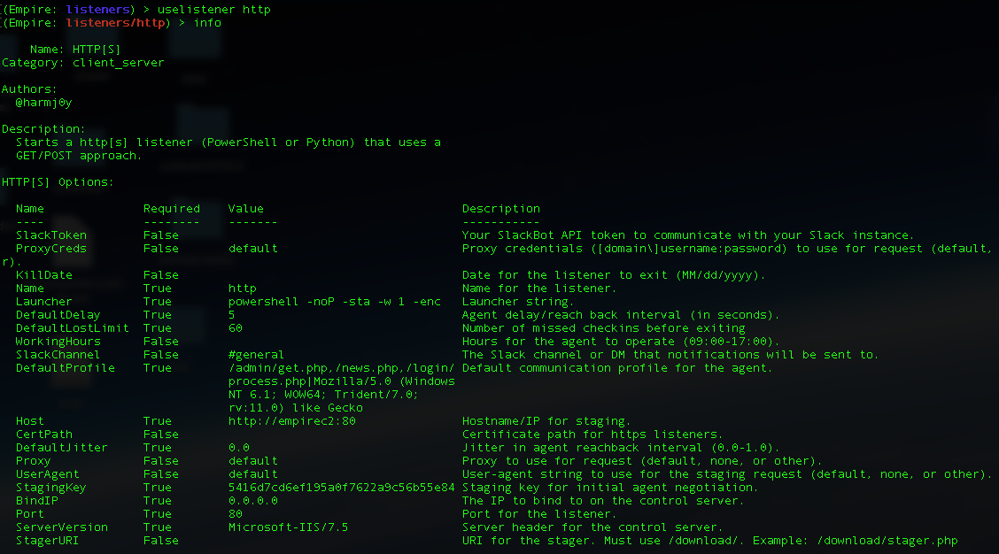
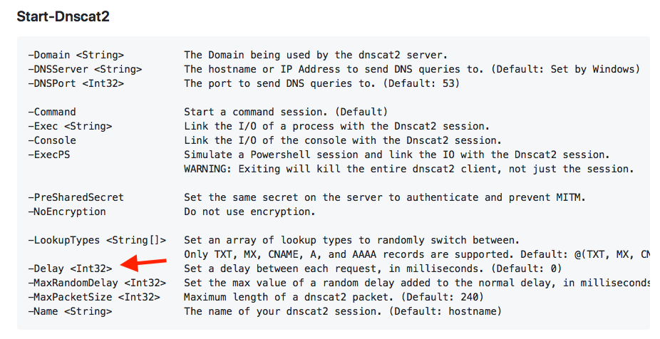
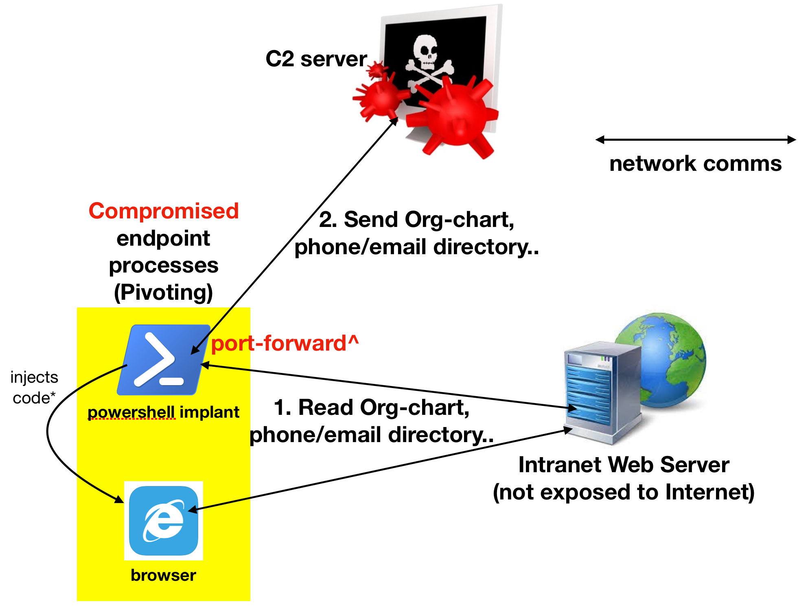

# C2 Over Commonly Used Port

## Background

https://attack.mitre.org/wiki/Technique/T1043: Adversaries may communicate over a commonly used port to bypass firewalls or network detection systems and to blend with normal network activity to avoid more detailed inspection.

## Beaconing over Commonly Used Ports

| Protocols                                            | Toolkits                                          |
| ---------------------------------------------------- | ------------------------------------------------- |
| DNS                                                  | https://github.com/lukebaggett/dnscat2-powershell |
| HTTP(S)                                              | https://github.com/EmpireProject/Empire           |
| [Websocket](https://en.wikipedia.org/wiki/WebSocket) | https://github.com/Arno0x/WSC2                    |

You may ask how about other protocols like ICMP & what not. Sysmon can only report successful TCP & UDP connections. For instance in Empire, you can configure how frequent the Powershell agent is going to call-home:

Similarly for **dnscat2**:

## Network Inspection Enough?

Unlike the other tactics which may have a sequence of different Sysmon event types, C2 traffic is rather "straight forward": **Event ID 3**. I will **won't be detailing** each EVTX logs like [code-execution](https://github.com/jymcheong/SysmonResources/tree/master/6.%20Sample%20Data/stage%202%20(Get%20In)/2.%20run%20payloads) & [persistence](https://github.com/jymcheong/SysmonResources/tree/master/6.%20Sample%20Data/stage%202%20(Get%20In)/3.%20install%20payloads). Regardless of protocol, I just want to use the illustration below to highlight **a fundamental gap of just looking at network traffic/sensors alone**:

Consider this scenario of **Internal** **Reconnaisance**. Again like External vs Internal C2, there should also be distinction between reconnaisance that is probing external facing services (eg. open ports & services) vs internal resources like in this case. *The severity is different obviously for the latter since the adversary has already gotten External C2 over the machine in question.*

**Suppose we only had network traffic to analyse, it is rather challenging to differentiate in Step 1, between a legit access to Intranet resources and one that was remotely controlled by an External C2 server.**

<u>As such, the value of Sysmon Event ID 3 is</u> ***which process has accessed what destination address & port***. Even if there is a proxy server in between the client to the Internet, we need to ask ourselves how frequent is it for non-browser processes communicating at port 80 &/or 443. ***But to illustrate the point with some of these sample logs, with the exception of HTTP(S) C2 like Metasploit/Empire, you will see that Event ID 3 for the relevant offensive process ONLY ONCE*** (for DNS & Websocket).

*To make it harder for defenders to detect, a careful adversary may just inject codes into a browser & perform the Internal Reconnaissance with that process. So it also make sense to be able to record "cross-process" activities, which is recorded by Sysmon too.*